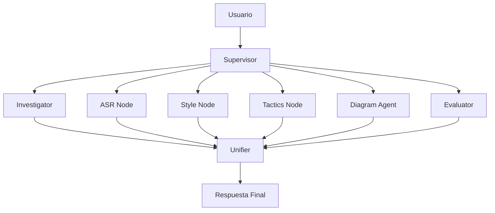

# ArchIA - Documentación Técnica del Sistema (v2)

> **Versión**: 2.0 (Refactorizada)
> **Fecha**: Febrero 2025
> **Tipo de documento**: Especificación Técnica de Arquitectura

---

## 1. Introducción

### 1.1 Propósito de ArchIA

**ArchIA** es un asistente inteligente especializado en el diseño de arquitectura de software. Su propósito principal es asistir a arquitectos y equipos de desarrollo durante las fases tempranas del ciclo de vida del desarrollo de software (SDLC), específicamente en:

| Fase del SDLC              | Contribución de ArchIA                                                              |
| -------------------------- | ----------------------------------------------------------------------------------- |
| **Análisis de Requisitos** | Identificación y extracción de requisitos arquitectónicamente significativos (ASRs) |
| **Diseño Arquitectónico**  | Recomendación de estilos arquitectónicos y tácticas de diseño                       |
| **Documentación**          | Generación de diagramas visuales y documentación técnica                            |
| **Validación**             | Consulta de documentación técnica de referencia (PDFs)                              |

### 1.2 Paradigma de Interacción

A diferencia de un chat lineal convencional, ArchIA opera mediante un **Grafo de Estados (State Graph)**. Cada mensaje del usuario inicia un flujo de razonamiento donde un "Cerebro Central" (nodo supervisor) evalúa la petición y orquesta la ejecución de herramientas especializadas antes de generar una respuesta final.



---

## 2. Arquitectura del Flujo (El Grafo de Estados)

### 2.1 Modelo de Razonamiento

El sistema utiliza **LangGraph** como motor de orquestación, implementando un grafo de estados modularizado en el paquete `src.graph`. El flujo sigue este ciclo:

```
┌─────────────────────────────────────────────────────────────────┐
│                     CICLO DE PROCESAMIENTO                       │
├─────────────────────────────────────────────────────────────────┤
│  1. ENTRADA      → Usuario envía mensaje                        │
│  2. SUPERVISOR   → Analiza intención y contexto                 │
│  3. ROUTING      → Decide qué nodo(s) especializado(s) activar  │
│  4. EJECUCIÓN    → Nodo(s) especializado(s) procesan la tarea   │
│  5. UNIFICACIÓN  → Se consolida la información generada         │
│  6. RESPUESTA    → Se genera y entrega respuesta al usuario     │
└─────────────────────────────────────────────────────────────────┘
```

### 2.2 Nodo Supervisor (`nodes.supervisor`)

El **Supervisor** es el coordinador principal del sistema. Su responsabilidad es:

1. **Análisis de Intención**: Determina qué tipo de solicitud hace el usuario (`general`, `greeting`, `architecture`, `diagram`, `asr`, `tactics`, `style`)
2. **Detección de Idioma**: Identifica si el usuario escribe en español o inglés (`nodes.classifier`)
3. **Decisión de Enrutamiento**: Selecciona el siguiente nodo a ejecutar

**Estructura de la respuesta del Supervisor:**

```python
class supervisorResponse(TypedDict):
    localQuestion: str  # Pregunta refinada para el nodo worker
    nextNode: Literal[
        "investigator",   # Búsqueda en documentación
        "evaluator",      # Evaluación/análisis
        "diagram_agent",  # Generación de diagramas
        "tactics",        # Sugerencia de tácticas
        "asr",            # Requisitos significativos
        "style",          # Estilos arquitectónicos
        "unifier"         # Consolidación final
    ]
```

### 2.3 Nodos Especializados (`src/graph/nodes/`)

El sistema modular organiza cada agente en su propio archivo dentro del paquete `src.graph.nodes`:

| Nodo              | Archivo           | Función                        | Cuándo se Activa                               |
| ----------------- | ----------------- | ------------------------------ | ---------------------------------------------- |
| **Investigator**  | `investigator.py` | Búsqueda RAG en documentos PDF | Consultas que requieren fundamentación técnica |
| **ASR**           | `asr.py`          | Extracción de requisitos       | Identificación de requisitos significativos    |
| **Style**         | `style.py`        | Recomendación de estilos       | Selección de patrones arquitectónicos          |
| **Tactics**       | `tactics.py`      | Sugerencia de tácticas         | Mejora de atributos de calidad                 |
| **Diagram Agent** | `diagram.py`      | Generación de diagramas        | Visualización de arquitecturas (Mermaid)       |
| **Creator**       | `creator.py`      | (Legacy/Soporte)               | Generación de contenido auxiliar               |
| **Evaluator**     | `evaluator.py`    | Análisis y comparación         | Evaluación de opciones arquitectónicas         |
| **Unifier**       | `unifier.py`      | Consolidación                  | Siempre al final del flujo                     |

### 2.4 Estado del Grafo (`src/graph/state.py`)

El sistema mantiene un estado tipado (`GraphState`) que define la estructura de memoria compartida:

```python
class GraphState(TypedDict):
    # Control de flujo
    messages: list[AnyMessage]     # Historial de conversación
    userQuestion: str              # Pregunta original
    localQuestion: str             # Pregunta refinada
    nextNode: str                  # Siguiente nodo a ejecutar

    # Flags de visita
    hasVisitedInvestigator: bool
    hasVisitedEvaluator: bool
    hasVisitedASR: bool
    hasVisitedDiagram: bool

    # Contexto arquitectónico
    current_asr: str               # ASR vigente
    quality_attribute: str         # Atributo de calidad principal
    selected_style: str            # Estilo seleccionado
    tactics_list: list             # Lista de tácticas
    tactics_struct: list           # Estructura JSON de tácticas

    # RAG y memoria
    doc_context: str               # Contexto de documentos
    retrieved_docs: list           # Documentos recuperados
    memory_text: str               # Memoria de conversación

    # Diagramas
    mermaidCode: str               # Código Mermaid generado
    diagram: dict                  # Datos del diagrama
```

---

## 3. Desglose de Componentes

### 3.1 Módulo de Documentación (RAG)

**Propósito**: Capacidad de buscar información dentro de archivos PDF proporcionados por el usuario para dar respuestas con fundamentación técnica.

**Implementación**:

- Nodo: [`src/graph/nodes/investigator.py`](file:///c:/Users/mgs05/Documents/GargoyleArchitecture/NewArchIA/archIABack/back/src/graph/nodes/investigator.py)
- Herramienta: `local_RAG` en [`src/graph/nodes/tools.py`](file:///c:/Users/mgs05/Documents/GargoyleArchitecture/NewArchIA/archIABack/back/src/graph/nodes/tools.py)
- Dependencia: [`src/rag_agent.py`](file:///c:/Users/mgs05/Documents/GargoyleArchitecture/NewArchIA/archIABack/back/src/rag_agent.py) (Provee `get_retriever`)
- Base de datos vectorial: **ChromaDB**

**Flujo de trabajo**:
El nodo `Investigator` decide si llamar a `local_RAG`. Si lo hace, `local_RAG` invoca al retriever (cargado lazy en `resources.py`), consulta ChromaDB y devuelve fragmentos relevantes que el LLM sintetiza.

### 3.2 Módulo de Visualización (Diagramas)

**Propósito**: Transformar descripciones textuales en diagramas arquitectónicos visuales usando Mermaid.js.

**Implementación**:

- Nodo: [`src/graph/nodes/diagram.py`](file:///c:/Users/mgs05/Documents/GargoyleArchitecture/NewArchIA/archIABack/back/src/graph/nodes/diagram.py)
- Orquestación: El nodo construye un prompt con el ASR, Estilo y Tácticas seleccionadas y solicita al LLM generar código Mermaid.
- Renderizado: El frontend (`MermaidChart.jsx`) recibe el código crudo y lo renderiza en el navegador.

### 3.3 Módulo de Recomendación

**Implementación**:

- **Estilos**: [`src/graph/nodes/style.py`](file:///c:/Users/mgs05/Documents/GargoyleArchitecture/NewArchIA/archIABack/back/src/graph/nodes/style.py) evalúa el ASR y sugiere patrones (Microservicios, Event-driven, etc.).
- **Tácticas**: [`src/graph/nodes/tactics.py`](file:///c:/Users/mgs05/Documents/GargoyleArchitecture/NewArchIA/archIABack/back/src/graph/nodes/tactics.py) utiliza una búsqueda semántica para encontrar tácticas de ADD 3.0 que satisfagan el atributo de calidad (ej. Latencia -> Caching).

### 3.4 Módulo de Requisitos (ASR)

**Implementación**: [`src/graph/nodes/asr.py`](file:///c:/Users/mgs05/Documents/GargoyleArchitecture/NewArchIA/archIABack/back/src/graph/nodes/asr.py)
Extrae y estructura requisitos usando el formato canónico de 6 partes (Source, Stimulus, Artifact, Environment, Response, Response Measure).

---

## 4. Modelo de Persistencia

### 4.1 Visión General

```
┌─────────────────────────────────────────────────────────────────┐
│                     CAPAS DE PERSISTENCIA                       │
├─────────────────────────────────────────────────────────────────┤
│                                                                  │
│  ┌───────────────┐  ┌───────────────┐  ┌───────────────┐        │
│  │  ChromaDB     │  │  Memory       │  │  SQLite       │        │
│  │  (chroma_db/) │  │  (RAM)        │  │  (feedback_db)│        │
│  ├───────────────┤  ├───────────────┤  ├───────────────┤        │
│  │ Embeddings    │  │ Estado        │  │ Likes/Dislikes│        │
│  │ documentos    │  │ del grafo     │  │ por mensaje   │        │
│  └───────────────┘  └───────────────┘  └───────────────┘        │
│                                                                  │
└─────────────────────────────────────────────────────────────────┘
```

### 4.2 Almacenamiento de Estado del Grafo (Runtime)

**Tecnología**: LangGraph `MemorySaver`
**Ubicación de código**: [`src/graph/resources.py`](file:///c:/Users/mgs05/Documents/GargoyleArchitecture/NewArchIA/archIABack/back/src/graph/resources.py)

A diferencia de la versión 1.0, el estado del grafo se mantiene **en memoria (RAM)** durante la ejecución de la instancia. Esto evita problemas de concurrencia y locking con SQLite en entornos asíncronos de alto rendimiento.

El historial de la sesión se mantiene mientras el servidor esté activo.

### 4.3 Almacenamiento de Feedback y Memoria Persistente

El proyecto mantiene bases de datos SQLite para propósitos específicos fuera del ciclo de ejecución del grafo:

- **Feedback**: `back/feedback_db/feedback.db` (reacciones de usuarios).
- **Memoria Global**: `src/memory.py` puede usar SQLite para historial a largo plazo si se configura.

---

## 5. Jerarquía de Archivos (Estructura v2)

```
ArchIA/
├── back/                           # Backend Python
│   ├── src/
│   │   ├── main.py                 # Entry point FastAPI
│   │   ├── memory.py               # Gestión de memoria
│   │   ├── rag_agent.py            # (Core lib) Implementación RAG
│   │   ├── diagram_agent.py        # (Legacy/Lib) Diagram logic
│   │   │
│   │   ├── graph/                  # NUEVO: Paquete Modular del Grafo
│   │   │   ├── __init__.py         # Exposes 'graph' object
│   │   │   ├── workflow.py         # Definición del flujo LangGraph
│   │   │   ├── state.py            # TypedDicts (GraphState)
│   │   │   ├── consts.py           # Prompts y constantes
│   │   │   ├── resources.py        # LLM, Retriever, Checkpointer (Lazy)
│   │   │   ├── utils.py            # Funciones auxiliares
│   │   │   └── nodes/              # Nodos de lógica
│   │   │       ├── __init__.py
│   │   │       ├── supervisor.py   # Router
│   │   │       ├── investigator.py # RAG Node
│   │   │       ├── asr.py          # ASR Node
│   │   │       ├── style.py        # Style Node
│   │   │       ├── tactics.py      # Tactics Node
│   │   │       ├── diagram.py      # Diagram Orchestrator
│   │   │       ├── evaluator.py    # Evaluator Node
│   │   │       ├── creator.py      # Creator Node
│   │   │       ├── unifier.py      # Unifier Node
│   │   │       ├── classifier.py   # Intent Classifier
│   │   │       └── tools.py        # LangChain Tools
│   │   │
│   │   ├── services/
│   │   │   ├── llm_factory.py      # Factory de modelos LLM
│   │   │   └── doc_ingest.py       # Ingesta de documentos
│   │   └── utils/
│   │       └── json_helpers.py     # Utilidades JSON
│   ├── chroma_db/                  # Base vectorial
│   ├── feedback_db/                # Feedback de usuarios
│   └── docs/                       # PDFs de referencia
│
├── front/                          # Frontend React
└── README.md                       # Instrucciones de arranque
```

---

## 6. Consideraciones Técnicas Actualizadas

### 6.1 Mejoras de la Refactorización

1.  **Modularidad**: El monolito `graph.py` se dividió en 15+ archivos especializados, facilitando el mantenimiento y las pruebas unitarias.
2.  **Estabilidad de Arranque**: Se implementó **Lazy Loading** para recursos críticos (OpenAI, ChromaDB) en `src/graph/resources.py`, eliminando crashes por variables de entorno faltantes al inicio.
3.  **Gestión de Dependencias**: Se clarificaron las importaciones y se eliminaron ciclos (ej. entre `evaluator` y `supervisor`).
4.  **Checkpointing Robusto**: Se migró de `SqliteSaver` (problemático con context managers) a `MemorySaver` para una gestión de estado fiable en memoria.

### 6.2 Ejecución

El punto de entrada sigue siendo el mismo:

```bash
cd back
poetry run uvicorn src.main:app --port 8000
```
