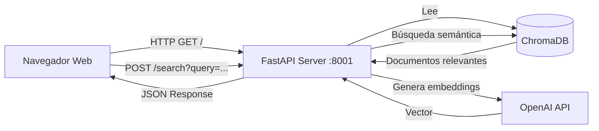

# Interfaz Web ChromaDB Explorer - Documentación

> **Versión**: 1.0  
> **Fecha**: Febrero 2026  
> **Tipo de documento**: Documentación de Herramienta de Soporte

---

## 1. Introducción

### 1.1 ¿Qué es ChromaDB Explorer?

**ChromaDB Explorer** es una interfaz web interactiva desarrollada para facilitar la visualización, exploración y gestión de la base de datos vectorial utilizada por el sistema RAG (Retrieval-Augmented Generation) de ArchIA.

### 1.2 Motivación y Propósito

Durante el desarrollo y mantenimiento de ArchIA, surgió la necesidad de:

1. **Visualizar el contenido** de la base de datos vectorial sin necesidad de escribir código Python cada vez
2. **Validar** que los documentos PDF fueron correctamente ingestados y fragmentados (chunked)
3. **Probar búsquedas semánticas** de forma interactiva para ajustar parámetros del RAG
4. **Monitorear** el estado y estadísticas de la base de datos vectorial
5. **Depurar** problemas relacionados con la recuperación de documentos

ChromaDB, por defecto, **no incluye una interfaz gráfica oficial**, por lo que esta herramienta fue desarrollada específicamente para cubrir esta necesidad operativa.

---

## 2. ¿Por qué se creó esta interfaz?

### 2.1 Limitaciones de ChromaDB

ChromaDB es una base de datos vectorial diseñada para ser embebida en aplicaciones Python. A diferencia de bases de datos relacionales tradicionales:

- **No tiene interfaz gráfica nativa**: No existe un "pgAdmin" o "MySQL Workbench" para ChromaDB
- **Almacenamiento híbrido**: Usa SQLite para metadatos pero archivos binarios para vectores
- **Acceso por código**: Requiere scripts Python para consultar o explorar datos

### 2.2 Problema Identificado

Durante el desarrollo, necesitábamos responder preguntas como:

- ¿Cuántos documentos se ingestaron correctamente?
- ¿Qué contenido tiene cada chunk?
- ¿La búsqueda semántica está retornando resultados relevantes?
- ¿Los metadatos (fuente, página) se almacenaron correctamente?

Escribir scripts Python repetidamente para cada consulta era **ineficiente y lento**.

### 2.3 Solución Implementada

Se desarrolló **chroma_web.py**: un servidor web FastAPI con una interfaz HTML/JavaScript que:

✅ Permite explorar la base de datos desde el navegador  
✅ Proporciona búsqueda semántica interactiva  
✅ Muestra estadísticas en tiempo real  
✅ Ofrece una API REST documentada para integraciones  

---

## 3. Arquitectura de la Interfaz

### 3.1 Stack Tecnológico

```
┌─────────────────────────────────────────────────────────┐
│                    STACK TECNOLÓGICO                    │
├─────────────────────────────────────────────────────────┤
│                                                          │
│  Frontend:   HTML5 + JavaScript (Vanilla)               │
│  Backend:    FastAPI (Python 3.11+)                     │
│  BD:         ChromaDB (vectores) + SQLite (metadata)    │
│  Embeddings: OpenAI text-embedding-3-small              │
│  Puerto:     8001                                        │
│                                                          │
└─────────────────────────────────────────────────────────┘
```

### 3.2 Flujo de Datos



---

## 4. Componentes de la Interfaz

### 4.1 Dashboard Principal

La página principal (`http://localhost:8001`) incluye:

#### **Sección 1: Estadísticas Generales**

Muestra tres tarjetas con información clave:

| Métrica | Descripción |
|---------|-------------|
| **Total Documentos** | Número de chunks almacenados en ChromaDB |
| **Colección** | Nombre de la colección activa (`arquia`) |
| **Fuentes** | Cantidad de libros/documentos únicos |

#### **Sección 2: Búsqueda Semántica**

Permite realizar búsquedas en lenguaje natural:

- **Input de texto**: Para escribir la consulta (ej: "software architecture patterns")
- **Control de resultados**: Número de documentos a retornar (k=1-20)
- **Botón de búsqueda**: Dispara la búsqueda y muestra resultados

Los resultados muestran:
- Fuente del documento (libro)
- Número de página
- Contenido del chunk

#### **Sección 3: Documentos por Fuente**

Lista agregada que muestra:
- Nombre de cada libro
- Cantidad de chunks por libro

Ejemplo:
```
📚 Documentos por Fuente
  • Software Architecture in Practice (3e): 99 chunks
  • Evaluating Software Architectures: 556 chunks
```

#### **Sección 4: Lista de Documentos** ⭐ (Nueva)

Muestra los primeros 50 documentos con:
- Número secuencial
- Fuente (libro de origen)
- Número de página
- Preview de contenido (200 caracteres)

Incluye botón **"Cargar más"** para paginación dinámica.

### 4.2 API REST Documentada

Accesible en `http://localhost:8001/docs` (Swagger UI)

#### Endpoints disponibles:

| Método | Endpoint | Descripción |
|--------|----------|-------------|
| `GET` | `/` | Interfaz web principal (HTML) |
| `GET` | `/api/stats` | Estadísticas de la base de datos (JSON) |
| `GET` | `/search` | Búsqueda semántica con parámetros query y k |
| `GET` | `/documents` | Lista de documentos con paginación (limit/offset) |

#### Ejemplo de uso de la API:

```bash
# Obtener estadísticas
curl http://localhost:8001/api/stats

# Búsqueda semántica
curl "http://localhost:8001/search?query=software%20architecture&k=5"

# Obtener documentos (paginación)
curl "http://localhost:8001/documents?limit=10&offset=0"
```

---

## 5. Requisitos para Ejecutar la Interfaz

### 5.1 Dependencias

```python
# Ya incluidas en el proyecto
fastapi>=0.128.3
uvicorn[standard]>=0.40.0
langchain-chroma  # o langchain-community
chromadb>=1.4.1
langchain-openai>=1.1.7
python-dotenv>=1.2.1
```

### 5.2 Variables de Entorno Necesarias

Archivo `.env` (ubicado en `/back/.env`):

```bash
# Requerido: API Key de OpenAI para embeddings
OPENAI_API_KEY=sk-proj-...

# Opcional: Modelo de embeddings (default: text-embedding-3-small)
OPENAI_EMBED_MODEL=text-embedding-3-small

# Opcional: Directorio de ChromaDB (default: ./chroma_db)
CHROMA_DIR=./chroma_db
```

### 5.3 Prerequisitos

Antes de ejecutar la interfaz:

1. ✅ **Base de datos construida**: Ejecutar `build_vectorstore.py` para crear la base de datos vectorial
2. ✅ **Documentos PDF**: Colocar PDFs en `/back/docs/`
3. ✅ **API Key configurada**: Definir `OPENAI_API_KEY` en `.env`
4. ✅ **Entorno virtual activo**: Usar el `.venv` del proyecto

---

## 6. Cómo Ejecutar la Interfaz

### 6.1 Opción 1: Ejecución Directa (Recomendada)

```bash
# Navegar al directorio back
cd /Users/santiagocasasbuenasalarcon/Documents/universidad/tesis/archIABack/back

# Ejecutar el servidor
python chroma_web.py
```

**Salida esperada**:
```
======================================================================
🚀 ChromaDB Explorer Server
======================================================================
📁 Base de datos: /path/to/back/chroma_db
📊 Total documentos: 655
🌐 Interfaz web: http://localhost:8001
📖 API docs: http://localhost:8001/docs
======================================================================

Presiona Ctrl+C para detener el servidor
```

### 6.2 Opción 2: Con Script de Inicio

```bash
cd /Users/santiagocasasbuenasalarcon/Documents/universidad/tesis/archIABack/back

# Dar permisos de ejecución (solo la primera vez)
chmod +x start_chroma.sh

# Ejecutar
./start_chroma.sh
```

### 6.3 Acceso desde el Navegador

Una vez iniciado el servidor, abrir:

- **Interfaz principal**: http://localhost:8001
- **Documentación API**: http://localhost:8001/docs
- **Documentación alternativa**: http://localhost:8001/redoc

---

## 7. Casos de Uso

### 7.1 Validación Post-Ingesta

**Escenario**: Acabas de ejecutar `build_vectorstore.py` y quieres verificar que todo se ingestó correctamente.

**Pasos**:
1. Iniciar `chroma_web.py`
2. Revisar el **Total de Documentos** en el dashboard
3. Verificar en **Documentos por Fuente** que ambos libros aparecen
4. Explorar la **Lista de Documentos** para ver muestras del contenido

### 7.2 Prueba de Búsqueda Semántica

**Escenario**: Quieres ajustar el valor de `k` (número de documentos retornados) para optimizar el RAG.

**Pasos**:
1. Escribir una consulta típica: "What is a quality attribute scenario?"
2. Probar con diferentes valores de k (3, 5, 10)
3. Evaluar la relevancia de los resultados
4. Ajustar parámetros en `rag_agent.py` según observaciones

### 7.3 Depuración de Metadatos

**Escenario**: El sistema RAG no está filtrando correctamente por fuente.

**Pasos**:
1. Navegar a la **Lista de Documentos**
2. Verificar que el campo `source_title` esté poblado correctamente
3. Revisar el número de página para confirmar alineación
4. Usar la API `/documents` para inspeccionar metadatos programáticamente

### 7.4 Monitoreo de Crecimiento

**Escenario**: Vas a agregar más PDFs y quieres trackear el crecimiento de la base de datos.

**Pasos**:
1. Anotar el **Total de Documentos** antes de la ingesta
2. Ejecutar `build_vectorstore.py` con nuevos PDFs
3. Recargar la interfaz web
4. Comparar el nuevo total y verificar la nueva fuente en **Documentos por Fuente**

---

## 8. Características Técnicas Avanzadas

### 8.1 Manejo de Embeddings

La interfaz reutiliza la función `_embeddings()` de `rag_agent.py`:

```python
from src.rag_agent import _embeddings

# Configuración optimizada para evitar errores de límite de tokens
embedding_function = _embeddings()  # chunk_size=10
```

**Parámetros clave**:
- `chunk_size=10`: Procesa embeddings en batches de 10 documentos a la vez
- Evita el error `maximum context length is 8192 tokens` de OpenAI

### 8.2 Paginación Eficiente

La lista de documentos implementa paginación lazy-loading:

```javascript
// Frontend: Carga dinámica de documentos
let currentOffset = 50;

async function loadMoreDocuments() {
    const response = await fetch(`/documents?limit=50&offset=${currentOffset}`);
    const data = await response.json();
    // Renderizar nuevos documentos
    currentOffset += data.documents.length;
}
```

**Beneficios**:
- Carga inicial rápida (solo 50 documentos)
- Reduce consumo de memoria en el navegador
- Permite explorar bases de datos grandes (10k+ documentos)

### 8.3 Diseño Responsivo

El CSS incluye:
- Grid layouts adaptivos (`grid-template-columns: repeat(auto-fit, minmax(250px, 1fr))`)
- Scroll interno para secciones grandes (`max-height: 800px; overflow-y: auto`)
- Hover effects para mejorar UX

---

## 9. Limitaciones Conocidas

| Limitación | Descripción | Workaround |
|------------|-------------|------------|
| **Solo lectura** | No permite editar o eliminar documentos | Reconstruir la BD con `build_vectorstore.py` |
| **Un solo modelo de embeddings** | Usa el modelo definido en `.env` | Cambiar `OPENAI_EMBED_MODEL` y reiniciar |
| **No soporta Azure OpenAI** | Funciona con OpenAI público | La función `_embeddings()` ya soporta Azure |
| **Sin autenticación** | Cualquiera con acceso a localhost:8001 puede ver | Usar tunneling (ngrok) con cuidado o VPN |

---

## 10. Troubleshooting

### Problema: "No se encontraron resultados" en búsquedas

**Causa**: La base de datos está vacía o no se construyó correctamente.

**Solución**:
```bash
cd back
python build_vectorstore.py
```

### Problema: "Error: Invalid 'input': maximum context length is 8192 tokens"

**Causa**: Los chunks son muy grandes o el `chunk_size` de embeddings no está configurado.

**Solución**: Verificar que `rag_agent.py` tenga:
```python
return OpenAIEmbeddings(model=model, chunk_size=10)
```

### Problema: "Connection refused" al acceder a localhost:8001

**Causa**: El servidor no está corriendo o está en otro puerto.

**Solución**:
```bash
# Verificar que chroma_web.py esté corriendo
ps aux | grep chroma_web

# Si no está corriendo, iniciarlo
python chroma_web.py
```

### Problema: La interfaz no muestra documentos

**Causa**: Error en el código JavaScript o problema de CORS.

**Solución**: Abrir la consola del navegador (F12) y verificar errores. El servidor debe estar en el mismo host que el navegador accede.

---

## 11. Archivos Relacionados

| Archivo | Propósito |
|---------|-----------|
| [`chroma_web.py`](../chroma_web.py) | Servidor FastAPI con la interfaz web |
| [`start_chroma.sh`](../start_chroma.sh) | Script de inicio rápido |
| [`explore_db.py`](../explore_db.py) | Script CLI para exploración básica (sin interfaz web) |
| [`build_vectorstore.py`](../build_vectorstore.py) | Constructor de la base de datos vectorial |
| [`rag_agent.py`](../src/rag_agent.py) | Módulo RAG que usa ChromaDB |

---

## 12. Roadmap de Mejoras Futuras

### Versión 1.1 (Planificada)
- [ ] Autenticación básica con usuario/contraseña
- [ ] Filtros por fuente en la búsqueda semántica
- [ ] Exportación de resultados a CSV/JSON
- [ ] Visualización de embeddings con PCA/t-SNE

### Versión 2.0 (Propuesta)
- [ ] Soporte para múltiples colecciones
- [ ] Interfaz para re-ingestar documentos sin reconstruir la BD completa
- [ ] Integración con LangSmith para tracing de búsquedas
- [ ] Dashboard de métricas de uso (consultas más frecuentes)

---

## 13. Conclusión

La **Interfaz Web ChromaDB Explorer** es una herramienta de soporte esencial para el desarrollo y mantenimiento de ArchIA. Su creación responde a la necesidad práctica de visualizar y depurar la base de datos vectorial sin depender de scripts Python ad-hoc.

**Beneficios clave**:
✅ Acelera la validación de ingestas  
✅ Facilita experimentos con búsquedas semánticas  
✅ Proporciona transparencia sobre el contenido de la BD  
✅ Ofrece una API REST para automatizaciones  

**Mantenimiento**: Esta interfaz debe actualizarse si cambia la estructura de `GraphState` o los metadatos de documentos en `build_vectorstore.py`.

---

> **Documento creado por**: Equipo de Desarrollo ArchIA  
> **Última actualización**: Febrero 2026  
> **Versión del código**: chroma_web.py v1.0
